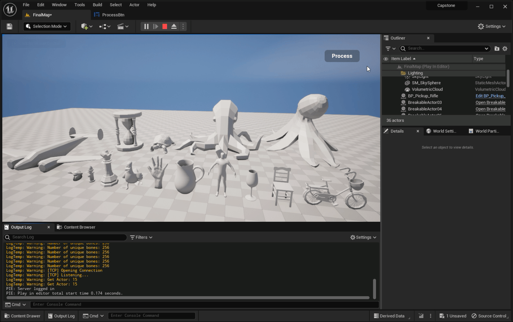

# Realtime Destruction
> <samp>[2023-1] Capstone Design team project ✘</samp><code>Q2 2023</code>, <code>2024.8.1 ~ 2024.11.27</code>  
> <samp>Neural Clustering for Prefractured Mesh Generation in Real-time Object Destruction</samp>

## 📽️ Demo

## 🔗 Related Links
- The DNN model for neural clustering is available in [**this repository**](https://github.com/overnap/neural-fracture).
- A detailed overview of the project's background and methods is provided in [**this paper**](https://arxiv.org/pdf/2502.04615).